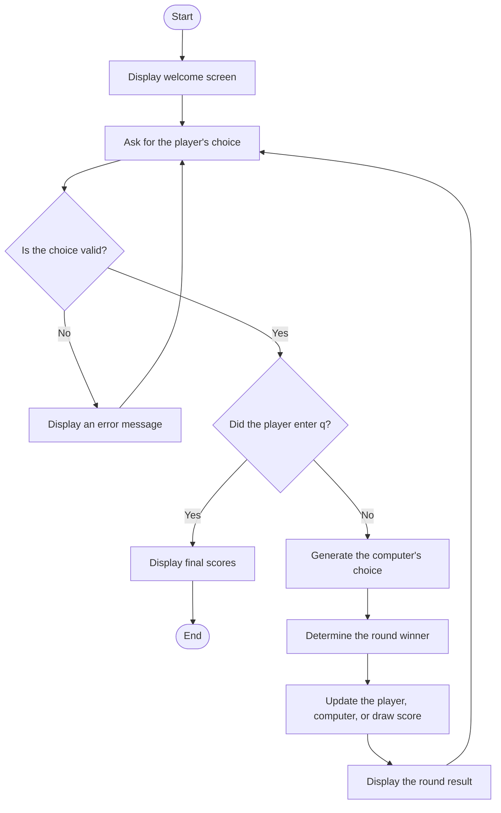

# Rock, Paper, Scissors

This is a mini project created for the portfolio assignment.
A simple console game written in Python. The player chooses rock, paper, or
scissors, and the computer makes a random choice. The game keeps score until
the player quits.

## Program flow



## How to run the game

1. Open a terminal in this folder.
2. Run:

   ```bash
   python3 rock_paper_scissors.py
   ```

3. Enter `rock`, `paper`, or `scissors` when asked.
4. Enter `q` to finish the game.

## Game rules

- Rock beats scissors.
- Scissors beats paper.
- Paper beats rock.
- Matching choices result in a draw.
# Rock-Paper-Scissors
